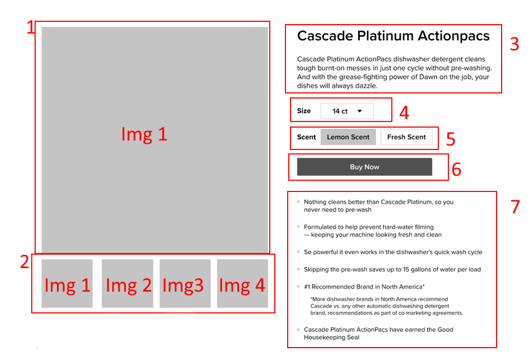
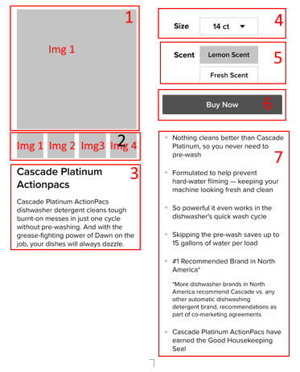

# Cascade Platinum Actionpacs

[]
[]

### Installation process :

- clone repo
- navigate to project folder
- install all dependencies with yarn or npm
- run with yarn or npm


```bash
$ git clone https://github.com/RandolphG/Product.Page.git
$ cd project
$ yarn or npm i
$ yarn dev or npm run dev
```

-	Create a reusable React component that will render the layout provided,
-   Design is responsive. 
-	Rendered data from a JSON file in a /config folder
-	Re-usability / component shouldn’t break on missing data
-	Selected image Images (2) the is shown in (1)
-	Can have more than 4 thumbnails, 
-	Use Slick and add carousel arrows (arrows not currently shown, but make them visible if needed)
-	Use Lorem Ipsum, the bolded section is h1
-	Size Select changes the images in (2) and consequently (1), create two size selections (14/28)
-	On click show alert() with lorem ipsum (in real life, a modal opens but let’s not waste time)
-	Lorem Ipsum, plain bullet list (disregard 5th inlined text, don’t waste time on this edge case)
-	For images use: https://via.placeholder.com/400/0000FF
